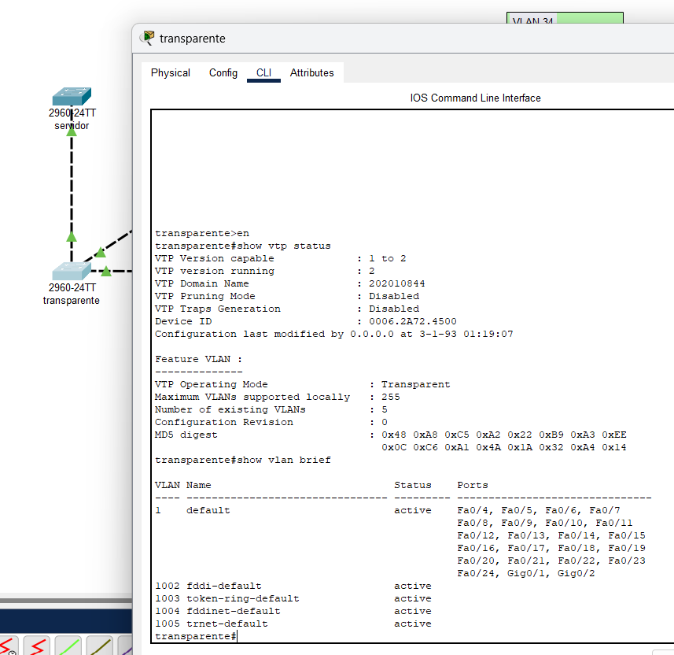

# Manual Técnico Hoja de trabajo 1 - Curso Redes

## Objetivo

El propósito de esta hoja de trabajo es comprender y aplicar el protocolo VTP (VLAN Trunking Protocol) en una red de switches, congurando diferentes modos de operación y vericando la propagación de VLANs en un entorno de red jerárquico.

## Solución

### Hardware y detalles de la red

- Switch 1: Nombre servidor, congurado como servidor VTP
- Switch 2: Nombre transparente, congurado como transparente VTP
- Switch 3: Nombre cliente01, congurado como cliente VTP
- Switch 4: Nombre cliente02, congurado como cliente VTP

#### Direccionamiento disponible
192.168.100.0 - 192.168.100.255
#### Máscara de sub red
255.255.255.0

#### VLAN's configuradas

VLAN14 -> ADMON
VLAN24 -> MERCA
VLAN34 -> VENTAS

### Comandos para configuración

#### Configuración para Switch "servidor"

Switch>en
Switch#config ter
Switch(config)# hostname servidor
servidor(config)# vtp mode server
servidor(config)# vtp domain 202010844
servidor(config)# vtp version 2
servidor(config)# vtp password 202010844

servidor(config)#interface range FastEthernet0/1-2
servidor(config-if-range)#switchport mode trunk
servidor(config-if-range)#switchport trunk allowed vlan 1,14,24,34
servidor(config-if-range)#exit
servidor(config)# exit
servidor# exit
servidor>

#### Configuración para switch "transparente"

Switch>en
Switch#config ter
Switch(config)# hostname transparente
transparente(config)# vtp mode transparent
transparente(config)# vtp domain 202010844
transparente(config)# vtp version 2
transparente(config)# vtp password 202010844

transparente(config)#interface range FastEthernet0/1-3
transparente(config-if-range)#switchport mode trunk
transparente(config-if-range)#switchport trunk allowed vlan 1,14,24,34
transparente(config-if-range)#exit

transparente(config)# exit
transparente# exit
transparente>

#### Configuración de switch "cliente01"

Switch>en
Switch#config ter
Switch(config)# hostname cliente01
cliente01(config)# vtp mode client
cliente01(config)# vtp domain 202010844
cliente01(config)# vtp version 2
cliente01(config)# vtp password 202010844

cliente01(config)#interface range FastEthernet0/1-2
cliente01(config-if-range)#switchport mode trunk
cliente01(config-if-range)#switchport trunk allowed vlan 1,14,24,34
cliente01(config-if-range)#exit

cliente01(config)# exit
cliente01# exit
cliente01>

#### Configuración de switch "cliente02"

Switch>en
Switch#config ter
Switch(config)# hostname cliente02
cliente02(config)# vtp mode client
cliente02(config)# vtp domain 202010844
cliente02(config)# vtp version 2
cliente02(config)# vtp password 202010844

cliente02(config)#interface range FastEthernet0/1-2
cliente02(config-if-range)#switchport mode trunk
cliente02(config-if-range)#switchport trunk allowed vlan 1,14,24,34
cliente02(config-if-range)#exit

cliente02(config)# exit
cliente02# exit
cliente02>

#### Creación de VLAN's en switch servidor

servidor> en
servidor# config term
servidor(config)# vlan 14
servidor(config-vlan)# name ADMON
servidor(config-vlan)# exit

servidor(config)# vlan 24
servidor(config-vlan)# name MERCA
servidor(config-vlan)# exit

servidor(config)# vlan 34
servidor(config-vlan)# name VENTAS
servidor(config-vlan)# exit

#### Asignación de VLAN's en sus interfaces

#### Switch "cliente01"

cliente01> en
cliente01# config ter
cliente01(config)# interface range FastEthernet0/10-14
cliente01(config-if)# switchport mode access
cliente01(config-if)# switchport access vlan 14
cliente01(config-if)# exit

cliente01(config)# interface range FastEthernet0/15-19
cliente01(config-if)# switchport mode access
cliente01(config-if)# switchport access vlan 24
cliente01(config-if)# exit

cliente01(config)# interface range FastEthernet0/20-24
cliente01(config-if)# switchport mode access
cliente01(config-if)# switchport access vlan 34
cliente01(config-if)# exit
cliente01(config)# exit
cliente01# exit
cliente01>

#### Switch "cliente02"

cliente02> en
cliente02# config ter
cliente02(config)# interface range FastEthernet0/10-14
cliente02(config-if)# switchport mode access
cliente02(config-if)# switchport access vlan 14
cliente02(config-if)# exit

cliente02(config)# interface range FastEthernet0/15-19
cliente02(config-if)# switchport mode access
cliente02(config-if)# switchport access vlan 24
cliente02(config-if)# exit

cliente02(config)# interface range FastEthernet0/20-24
cliente02(config-if)# switchport mode access
cliente02(config-if)# switchport access vlan 34
cliente02(config-if)# exit
cliente02(config)# exit
cliente02# exit
cliente02>

### Tabla de direccionamiento asignado

#### VLAN14

Rango definido -> 192.168.100.2 - 192.168.100.84

|Host|Direccion IP|switch|Puerto conectado a switch|
|----|----|----|---|
|PC-14-01|192.168.100.2|cliente02|Fa0/10|
|PC-14-02|192.168.100.3|cliente01|Fa0/10|

#### VLAN24

Rango definido -> 192.168.100.85 - 192.168.100.168

|Host|Direccion IP|switch|Puerto conectado a switch|
|----|----|----|---|
|PC-24-01|192.168.100.85|cliente02|Fa0/10|
|PC-24-02|192.168.100.86|cliente01|Fa0/10|

#### VLAN34

Rango definido -> 192.168.100.169 - 192.168.100.254

|Host|Direccion IP|switch|Puerto conectado a switch|
|----|----|----|---|
|PC-34-01|192.168.100.169|cliente02|Fa0/10|
|PC-34-02|192.168.100.170|cliente01|Fa0/10|

### Capturas donde se muestra el protocolo VTP

-   Ejecución en switch "servidor"

-   Ejecución en switch "transparente"

-   Ejecución en switch "cliente01"

-   Ejecución en switch "cliente02"

