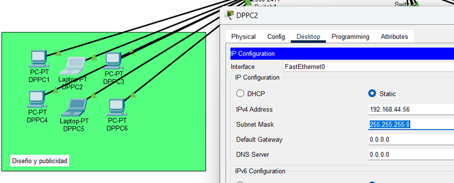
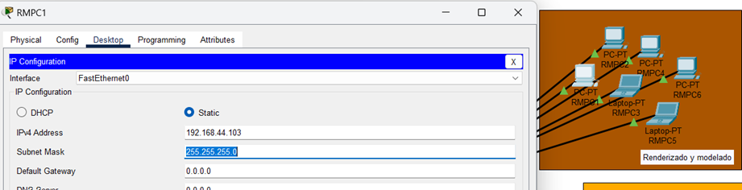
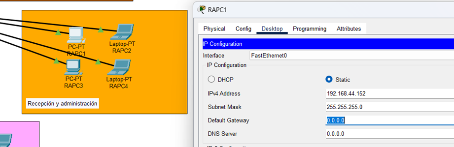
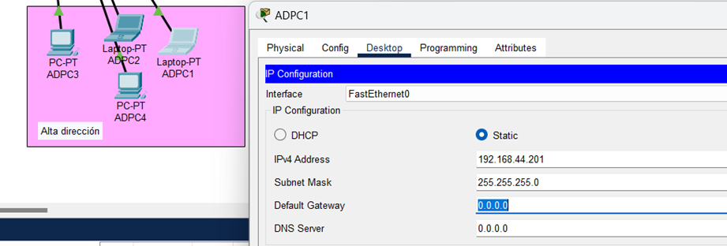
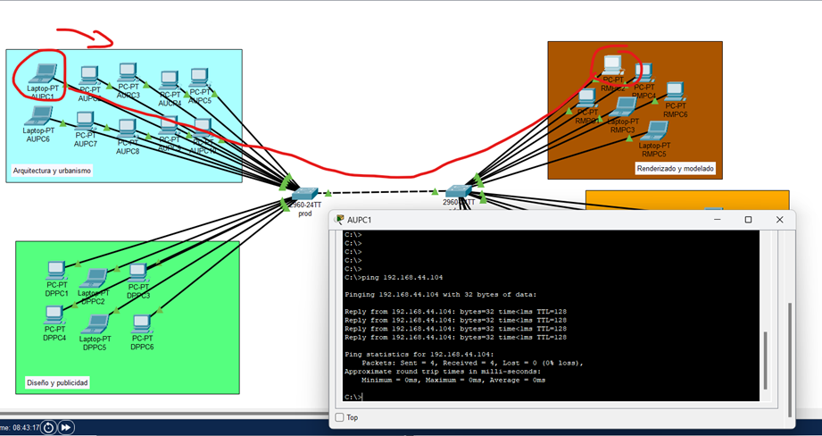
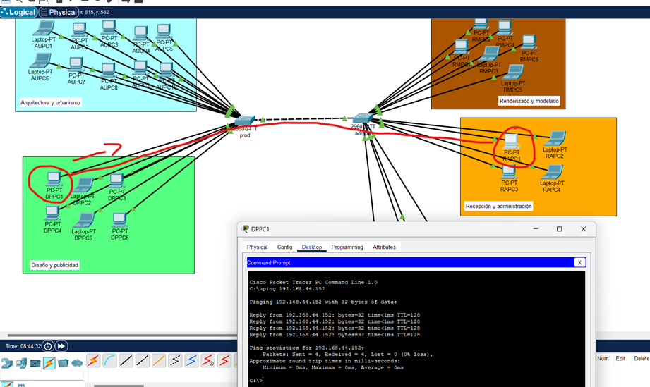
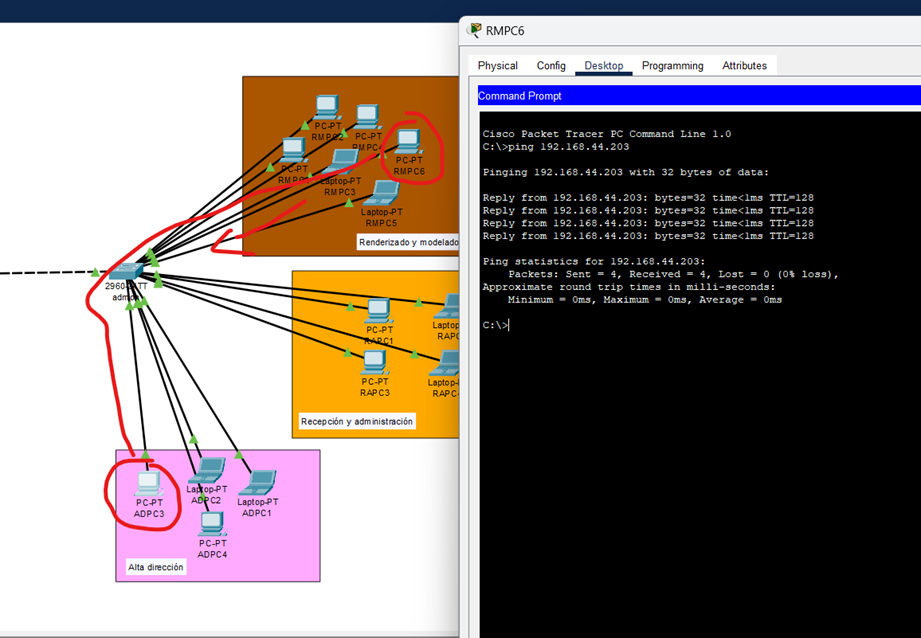
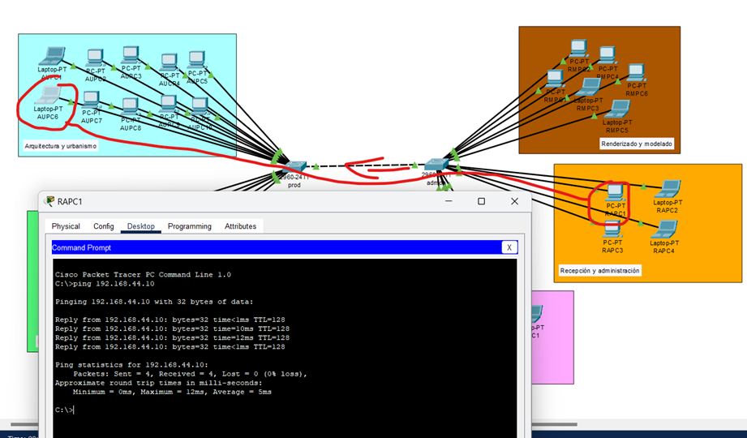
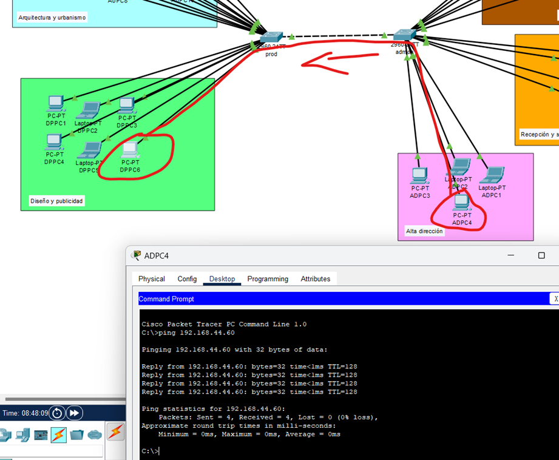
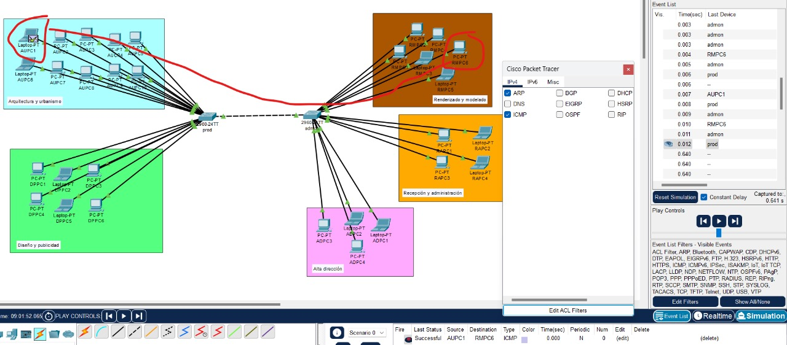

# Manual Técnico Práctica 1

## Enunciado

Sigma Studio es un estudio de arquitectura y diseño gráfico reconocido por su enfoque
innovador en la creación de espacios funcionales y estéticamente atractivos. Gracias a su
combinación de talento arquitectónico y creatividad digital, la empresa ha trabajado con
clientes en proyectos de urbanismo, interiorismo y diseño publicitario.
Recientemente, Sigma Studio ha sido seleccionado para colaborar en un proyecto de
revitalización urbana, donde deberá diseñar la transformación de espacios públicos en una
ciudad moderna. Para ello, el equipo necesita optimizar su infraestructura tecnológica y
mejorar la comunicación interna.
La gerencia ha decidido modernizar su red local y usted como miembro del equipo de IT
será el encargado de diseñar la nueva infraestructura de red. Antes de proceder con la
implementación, debe presentar un diseño detallado de la red, justificando la distribución de
las computadoras y la interconexión entre switches.
Desde su fundación hace cuatro años, Sigma Studio ha crecido hasta contar con 30
empleados, distribuidos en diferentes áreas clave. La empresa opera en una oficina
moderna y busca una solución de red eficiente y de bajo costo para compartir información y
trabajar en colaboración en sus proyectos.

El equipo de TI de la empresa ha recibido el siguiente requerimiento:
- Configurar una red local (LAN) en la oficina de Sigma Studio para permitir la
comunicación entre todas las computadoras.
- Todas las computadoras deben tener direcciones IP estáticas y poder hacer ping
entre sí.
- La red debe utilizar exactamente dos switches de capa 2 (modelo 2960).
- Se dispone de cableado UTP estándar para conectar las computadoras y switches.

## Solución propuesta

### Tabla de direcciones IP por área.

#### Área de arquitectura y urbanismo

Direccionamiento del área conectada al Switch 1, nombres de Host, prefijo de área ->AU+PC{1}
##### Rangos de direccionamiento asignados
192.168.44.5 - 192.168.44.54

| Hostname | Dirección IP | Puerto |
|------------|--------------|--------|
| AUPC1 | 192.168.44.5 | FasthEthernet0|
| AUPC2 | 192.168.44.6 | FasthEthernet0|
| AUPC3 | 192.168.44.7 | FasthEthernet0|
| AUPC4 | 192.168.44.8 | FasthEthernet0|
| AUPC5 | 192.168.44.9 | FasthEthernet0|
| AUPC6 | 192.168.44.10 | FasthEthernet0|
| AUPC7 | 192.168.44.11 | FasthEthernet0|
| AUPC8 | 192.168.44.12 | FasthEthernet0|
| AUPC9 | 192.168.44.13 | FasthEthernet0|
| AUPC10 | 192.168.44.14 | FasthEthernet0|

#### Área de Diseño Gráfico y publicidad

Direccionamiento del área conectada al Switch 1, nombres de Host, prefijo de área ->DP+PC{1}
##### Rangos de direccionamiento asignados
192.168.44.55 - 192.168.44.102

| Hostname | Dirección IP | Puerto |
|------------|--------------|--------|
| DPPC1 | 192.168.44.55 | FasthEthernet0|
| DPPC2 | 192.168.44.56 | FasthEthernet0|
| DPPC3 | 192.168.44.57 | FasthEthernet0|
| DPPC4 | 192.168.44.58 | FasthEthernet0|
| DPPC5 | 192.168.44.59 | FasthEthernet0|
| DPPC6 | 192.168.44.60 | FasthEthernet0|

#### Área de renderizado y modelado 3D

Direccionamiento del área conectada al Switch 2, nombres de Host, prefijo de área ->RM+PC{1}
##### Rangos de direccionamiento asignados
192.168.44.103 - 192.168.44.151

| Hostname | Dirección IP | Puerto |
|------------|--------------|--------|
| RMPC1 | 192.168.44.103 | FasthEthernet0|
| RMPC2 | 192.168.44.104 | FasthEthernet0|
| RMPC3 | 192.168.44.105 | FasthEthernet0|
| RMPC4 | 192.168.44.106 | FasthEthernet0|
| RMPC5 | 192.168.44.107 | FasthEthernet0|
| RMPC6 | 192.168.44.108 | FasthEthernet0|

#### Área de Recepción y administración

Direccionamiento del área conectada al Switch 2, nombres de Host, prefijo de área ->RA+PC{1}
##### Rangos de direccionamiento asignados
192.168.44.152 - 192.168.44.200

| Hostname | Dirección IP | Puerto |
|------------|--------------|--------|
| RAPC1 | 192.168.44.152 | FasthEthernet0|
| RAPC2 | 192.168.44.153 | FasthEthernet0|
| RAPC3 | 192.168.44.154 | FasthEthernet0|
| RAPC4 | 192.168.44.155 | FasthEthernet0|

#### Área de Alta dirección

Direccionamiento del área conectada al Switch 2, nombres de Host, prefijo de área ->AD+PC{1}
##### Rangos de direccionamiento asignados
192.168.44.201 - 192.168.44.254

| Hostname | Dirección IP | Puerto |
|------------|--------------|--------|
| ADPC1 | 192.168.44.201 | FasthEthernet0|
| ADPC2 | 192.168.44.202 | FasthEthernet0|
| ADPC3 | 192.168.44.203 | FasthEthernet0|
| ADPC4 | 192.168.44.204 | FasthEthernet0|

### Direccionamiento de los puerto del swtich 1

| Hostname | Puerto |
|--------|--------|
| admon | FasthEthernet0/1|
| AUPC1 | FasthEthernet0/5|
| AUPC2 | FasthEthernet0/6|
| AUPC3 | FasthEthernet0/7|
| AUPC4 | FasthEthernet0/8|
| AUPC5 | FasthEthernet0/9|
| AUPC6 | FasthEthernet0/10|
| AUPC7 | FasthEthernet0/11|
| AUPC8 | FasthEthernet0/12|
| AUPC9 | FasthEthernet0/13|
| AUPC10 | FasthEthernet0/14|
| DPPC1 | FasthEthernet0/15|
| DPPC2 | FasthEthernet0/16|
| DPPC3 | FasthEthernet0/17|
| DPPC4 | FasthEthernet0/18|
| DPPC5 | FasthEthernet0/19|
| DPPC6 | FasthEthernet0/20|

### Direccionamiento de los puerto del swtich 2

| Hostname | Puerto |
|--------|--------|
| prod | FasthEthernet0/1|
| RMPC1 | FasthEthernet0/5|
| RMPC2 | FasthEthernet0/6|
| RMPC3 | FasthEthernet0/7|
| RMPC4 | FasthEthernet0/8|
| RMPC5 | FasthEthernet0/9|
| RMPC6 | FasthEthernet0/10|
| RAPC1 | FasthEthernet0/11|
| RAPC2 | FasthEthernet0/12|
| RAPC3 | FasthEthernet0/13|
| RAPC4 | FasthEthernet0/14|
| ADPC1 | FasthEthernet0/15|
| ADPC2 | FasthEthernet0/16|
| ADPC3 | FasthEthernet0/17|
| ADPC4 | FasthEthernet0/18|

### Comando para configuración de switches

#### Switch 1
Comandos a ejecutar para configurar el switch 1:
-   Switch>enable
-   Switch#configure terminal
Enter configuration commands, one per line.  End with CNTL/Z.

-   Switch(config)#no ip domain-lookup
-   Switch(config)#hostname prod
-   prod(config)#enable secret 202010844
-   prod(config)#exit
prod#
%SYS-5-CONFIG_I: Configured from console by console

-   prod#exit

#### Switch 2
Comandos a ejecutar para configurar el switch 2:
-   Switch>enable
-   Switch#config terminal
Enter configuration commands, one per line.  End with CNTL/Z.

-   Switch(config)#no ip domain-lookup
-   Switch(config)#hostname admon
-   admon(config)#enable password 202010844
-   admon(config)#exit
-   admon#
%SYS-5-CONFIG_I: Configured from console by console
exit

### Configuración VPCs

-   Configuración de AUPC4, perteneciente al área de arquitectura y urbanismo.

-   Configuración de DPPC2, perteneciente al área de diseño y publicidad.

-   Configuración de RMPC1, perteneciente al área de Rendimiento y modelado. 

-   Configuración de RAPC1, perteneciente al área de Recepción y administración.

-   Configuración ADPC1, perteneciente al área de Alta dirección.

### Mensajes de ping entre hosts de distintas áreas

-   Ping entre host AUPC1 y RMPC2

-   Ping entre host DPPC1 y RAPC1

-   Ping entre host ADPC3 y RMPC6

-   Ping entre host RAPC1 y AUPC6

-   Ping entre host ADPC4 y DPPC6

### Mensaje ARP e ICMP en simulación
-   Mensaje ARP e ICMP en simulación con los host AUPC1 y RMPC6
